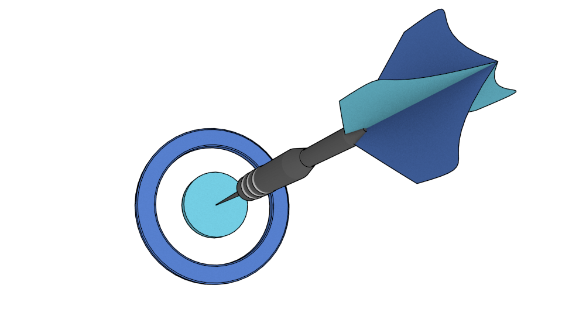
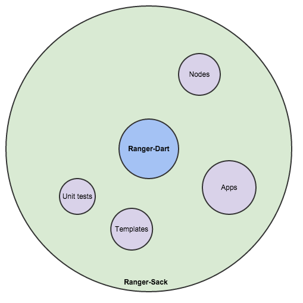

Ranger-Sack - v0.5.0 Beta
===========


##Contents:
- [About](#about-dart)
- [Templates, Applications and Unit tests](#templates)
- [Documentation](#documentation)
- [Google Blog](#blog)
- [Author](#author)
- [License](#license)
- [Development](#development)

###[About](#about-dart)
**Ranger-Sack** (**Sack** for short) is a sibling project relative to [**Ranger**-Dart]()

##[Ranger-Dart (**Ranger** for short)](https://github.com/wdevore/Ranger-Dart).



**Sack** simply serves as a goto place for examples that range from full apps, templates and unit tests. It also includes miscellaneous extensions/add-ons or enhancements.

###[Templates, Applications and Unit tests](#templates)
**Sack** comes with a suite of Templates, Applications and Unit tests. Each serves as a *howto* for starting a project or referencing during project development. When starting a new project you will copy one of the Templates and begin coding from there. The Applications and Unit tests are for later, after you have a project underway and want to know how to do something.

#### Templates
There are currently 7 Templates located under the *web* folder.
```
web/
    applications/
        templates/
```
Each Template progressively adds on a feature showing how to perform a basic task. For example, *level0* is the most basic: a Splace Scene and Splash Layer, and a GameScene and GameLayer.

- Level 0 - A stripped down basic framework template.
- Level 1 - Loads a single sprite asyncronously.
- Level 2 - Loads 5 sprites asyncronously and adds an overlay busy spinner.
- Level 3 - Basic keyboard activation and usage.
- Level 4 - Demonstrates basic Scene transition and animations.
- Level 5 - Demonstrates icon animation and HTML panel animation.
- Level 6 - Demonstrates a particle system.

#### Applications
There are currently 2 applications.
```
web/
    applications/
        ranger_particles/
        rocket/
```
*Ranger_particles* is a hand built HTML/CSS application that uses **Sack** to display the particles. The application itself is not complete meaning you can only save to local-storage. There is code to save to the GDrive but it hasn't been completely wired up. I know the GDrive code works because it is used in the [SpritePatch]() application to save and load sprite sheets.

*RangerRocket* is a demonstration of complex Node usage. In there you will find examples on how to map between "world-space" and "node-space" in order to handle particle placing and collision detection. It also shows the proper way of handling key presses.

#### Unit tests
There are many unit tests. Some are non-visual but many are visual. The original unit tests have all of the non-visual tests, for example, pooling and affine transformations; and they are a bit outdated so use with caution.
> A side note: When first looking to port Cocos2D-js the first thing I noticed was that the transform stack was a mess of incomprehension. I couldn't make complete sense of it and I didn't want to use something that I couldn't follow or understand. So the very first thing I did was scrap Cocos2D-js code and learn to make a transform stack myself. Forturnately I had worked with [Piccolo2D](http://www.cs.umd.edu/hcil/piccolo/) and understood how its stack worked.

The old test (some may not work as they were created almost a year ago) are located under the *old_tests* folder. The newest tests are under the *scenes/tests* folder.
```
web/
    unittests/
        old_tests/
        scenes/
            tests/
                colors/
                fonts/
                inputs/
                particlesystems/
                spaces/
                sprites/
                transforms/
                transitions/
```
The new tests cover pretty much all aspects of **Ranger**. They serve as both unit tests and as a resource to learn from.

###[Documentation](#documentation)
- [Getting started (Google doc)](https://docs.google.com/document/d/1k_vyVV9duqlMcCM4nZYc8B2BhyC_j4RXHg6WN6KSRPE/edit?usp=sharing)
- [Nodes (Google doc)](https://docs.google.com/document/d/1_uQJxKHuGpn82cWt3C2yBU-sfX2nb4BWKxhhJUpwKBA/edit?usp=sharing)
- [Animations (Google doc)](https://docs.google.com/document/d/1uFhSjwm1ehiZ3ni7yOUx5Cbf1LOVP9pcP3YcfumyFS4/edit?usp=sharing)
- [Scene Graph (Google doc)](https://docs.google.com/document/d/1CYAASqzukvdKToi7j9sv7TkiN4Le_ZjnFdN7I7uXqYI/edit?usp=sharing)
- [Development (--) -- NOT COMPLETE]()

These docs could help your game development. They are all a work in progress.

- [Misc -- NOT COMPLETE]()
- [Physics -- NOT COMPLETE]()
- [Collision -- NOT COMPLETE]()


###[Google Blog](#blog)
**Ranger** has a [Blog](https://plus.google.com/u/0/b/109136453872758385259/109136453872758385259/posts) where I periodically post statues.

###[Author](#author)
Hello, I am [Will DeVore](https://plus.google.com/u/0/b/104513085420089025698/104513085420089025698/posts) the current developer of **Ranger** and **Sack**. I find it a pleasure working with the [Dart](https://www.dartlang.org/) language. Its integration with HTML/CSS/Canvas/WebGL is solid and functional.

###[License](#license)
See [MIT license](LICENSE)

###[Development](#development)
When developing anything within **Sack** you have two choices as to which **Ranger** source you use:

- Directly from Github. In this case you can't modify **Ranger**'s source code but you can debug it.
    * git: git://github.com/wdevore/ranger-dart.git
- Or you clone **Ranger** to your desktop and reference it instead.
    * path: */some/where/*GitReposes/Ranger-Dart
